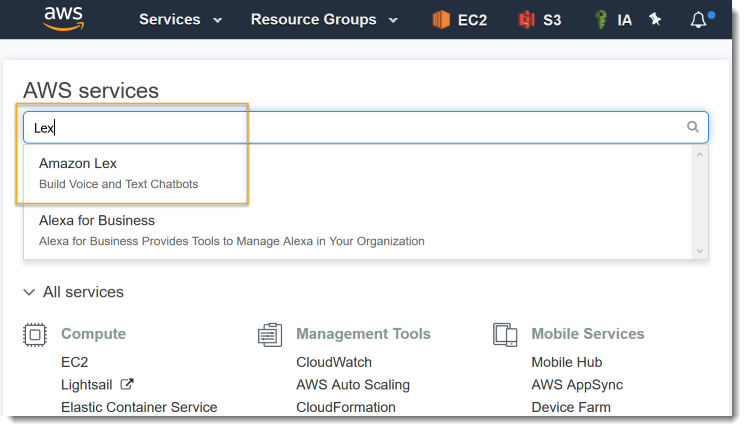
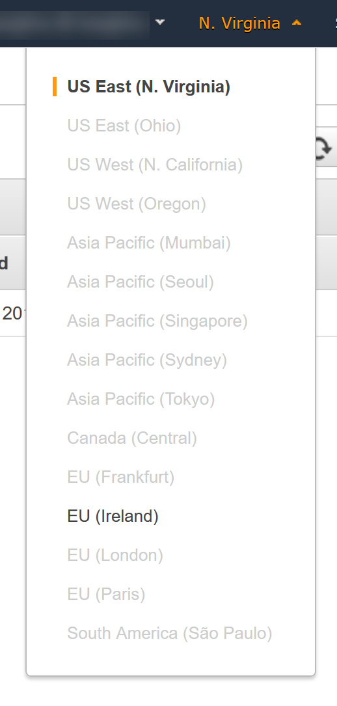
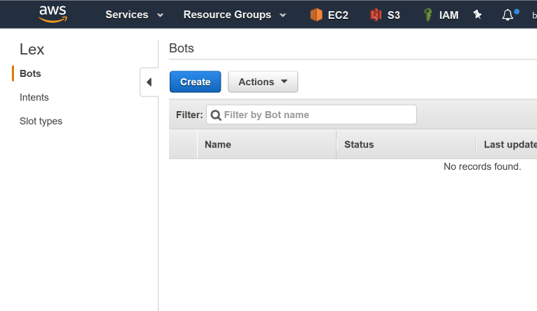
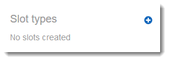
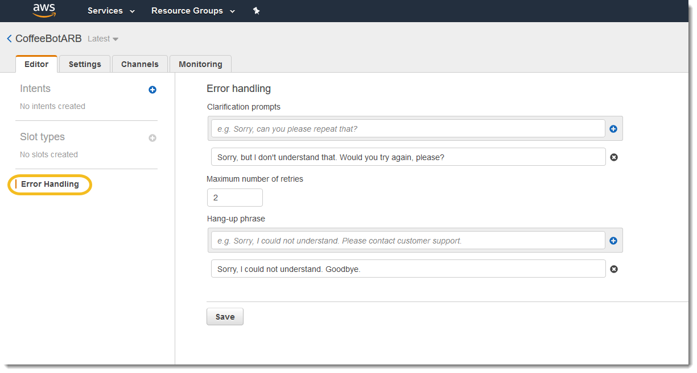
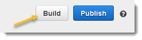
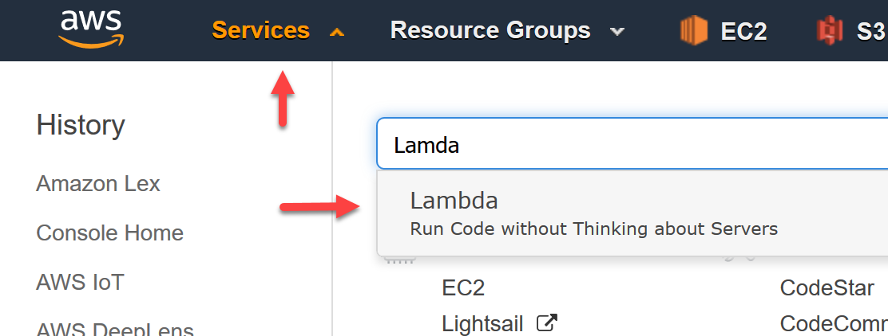
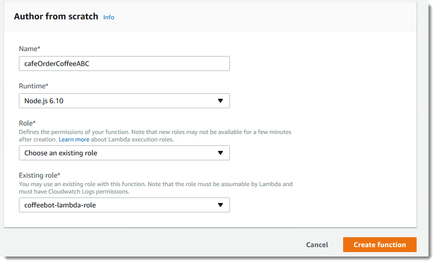
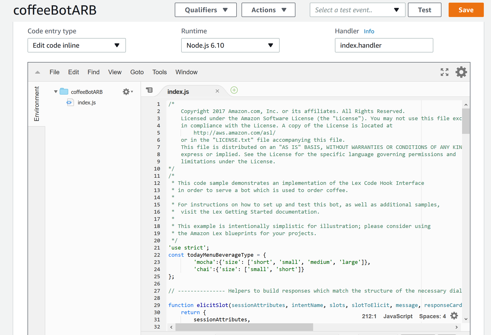

# Introduction

Amazon Lex is a service for building conversational interfaces into any application using voice and text. Amazon Lex provides the advanced deep learning functionalities of automatic speech recognition (ASR) for converting speech to text, and natural language understanding (NLU) to recognize the intent of the text, to enable you to build applications with highly engaging user experiences and lifelike conversational interactions. With Amazon Lex, the same deep learning technologies that power Amazon Alexa are now available to any developer, enabling you to quickly and easily build sophisticated, natural language, conversational bots (“chatbots”).

This workshop walks through the steps of creating an interactive chatbot using the AWS Lex service.


# CoffeeBot

CoffeeBot is a transactional chat bot that can help one order a coffee.

Consider this conversation:
> User:  May I have a mocha?

> CoffeeBot:  What size?  small, medium, large?

> User:  small

> CoffeeBot:  Would you like that iced or hot?

> User:  hot

> CoffeeBot:  You'd like me to order a small mocha.  Is that right?

> User:  Make it a large mocha

> CoffeeBot:  You'd like me to order a large mocha.  Is that right?

> User:  yeah

> CoffeeBot:  Great! Your mocha will be available for pickup soon. Thanks for using CoffeeBot!


First, we'll create the Amazon Lex bot.  Then, we'll add some Lambda Functions to bring it to life.  Lastly, as an optional step, create an Android application with the Mobile Hub and the Lex Android SDK.

## Amazon Lex bot
We will be creating a custom bot in the console and applying the necessary intents and custom slots in order to understand the coffee order.

### Navigate to Lex in the AWS Console

Once you are logged into your AWS account, you will be presented with a list of AWS services and a search box.  Type "Lex" into the search box and choose the "Amazon Lex" service.



You may be directed to select at region.  At the time of writing, Lex is only available in the Virginia and Ireland regions.  Choose the region that is the closest to you or the one that the instructor directs.



If this is your first time in the Amazon Lex console, you may be prompted with a welcome page.  Choose "Get Started" and then "Cancel" so that you are at the Lex page with "Bots", "Intents", and "Slot Types" on the left hand navigation.  If this isn't your first time, you will be brought directly to the Lex console.



#### Create bot
First, we'll create the bot.  

1. From the Amazon Lex console, select "Bots" on the left and then choose "Create" and choose "Custom Bot".  Create a Custom bot with these settings (you can see these in the "Settings" tab later)
    - Bot name:  `CoffeeBot`
		- To work independently in a shared environment, use your initials in the name (e.g., `CoffeeBotXXX`)
    - Output voice:  `Salli`
    - Session timeout:  `5 min`
    - IAM role:  (accept the default) `AWSServiceRoleForLexBots`
	- COPPA:  (our bot is not directed at children) `No`


#### Create Order Beverage Intent


From the left, add a new Intent called `cafeOrderBeverageIntent` with the following settings and click "Save Intent" to save the Intent.  
To work independently in a shared environment, use your initials in the Intent name (e.g., `cafeOrderBeverageIntentXXX`).

Add the following options to your intent:

1. Sample Utterances:  add these to the list of sample utterances so the bot recognizes similar phrases (each entry on a separate line)
```
I would like a {BeverageSize} {BeverageType}
Can I get a {BeverageType}
May I have a {BeverageSize} {Creamer} {BeverageType}
Can I get a {BeverageSize} {BeverageTemp} {Creamer} {BeverageType}
Let me get a {BeverageSize} {Creamer} {BeverageType}
```
1. Lambda initialization and validation (leave unchecked)
1. Fulfillment:  choose "Return parameters to client" for now
1. Confirmation prompt:  `You'd like me to order a {BeverageSize} {BeverageType}.  Is that right?` to confirm and `Okay.  Nothing to order this time.  See you next time!` to cancel.

When everything is entered, choose "Save Intent" at the bottom.

#### Create Slot types

In the upper left hand corner, select the "+" next to "Slot Type" to add new slots to your account.



Add the following Slot types (each value should be a separate entry). To work independently in a shared environment, use your initials in the names (e.g., `cafeBeverageTypeXXX`).  

Note:  Although they are saved with the AWS Account, ***Slot Types will only show up in the list on the left when they are associated in the next step.***  Keep creating slots until you've completed all in the following table:

Choose "Save Slot Type" when each one is completed.

Slot type name | Description | Values (each entry on a separate line)
-------------- | ----------- | --------------------
`cafeBeverageTypeXXX` | *Slot types are shared at the account level so text would help other developers determine if they can reuse this Slot type.*| `coffee`; `cappuccino`; `latte`; `mocha`; `chai`; `espresso`; `smoothie`
`cafeBeverageSizeXXX` | | `kids`; `small`; `medium`; `large`; `extra large`; `six ounce`; `eight ounce`; `twelve ounce`; `sixteen ounce`; `twenty ounce`
`cafeCreamerTypeXXX` | | `two percent`; `skim milk`; `soy`; `almond`; `whole`; `skim`; `half and half`
`cafeBeverageTempXXX` | | `kids`; `hot`; `iced`

#### Add Slots to the Intent
Navigate back to the intent page of your cafeOrderBeverageIntent, locate "Slots" midway down the page.

Add the following entries to the list of Slots, choosing the Slot Types created above.  Click "Save Intent".

Required | Name            | Slot type | Prompt
-------- | --------------- | --------- | -------------
`Yes` | `BeverageType` | `cafeBeverageType` | `What kind of beverage would you like?  For example, mocha, chai, etc.`
`Yes` | `BeverageSize` | `cafeBeverageSize` | `What size?  small, medium, large?`
`No (unchecked)` | `Creamer` | `cafeCreamerType` | `What kind of milk or creamer?`
`No (unchecked)` | `BeverageTemp` | `cafeBeverageTemp` | `Would you like that iced or hot?`

#### Error Handling

1. Navigate to the the Error handling settings and set the following



- Prompts:  (one prompt)  `Sorry, but I didn't understand that.  Would you try again, please?`
- Maximum number of retries:  `2`
- Hang-up phrase:  (one phrase) `Sorry, I could not understand.  Goodbye.`

#### Test



Click the build icon in the upper right hand corner to build the app.  This can take a few minutes.

Once built, a new panel will appear on the right of the Amazon Lex Console where you can test some of the Utterances in the Test Bot dialog.  For example, if you say `May I have a coffee?`, does Lex correctly map `coffee` to the `BeverageType` slot?

## Lambda Function
Now that we've tested that our application works, let's add more logic to validate our choices and handle the processing of the order.  We'll be using another service called AWS Lambda to do this.  AWS Lambda lets you run code without provisioning or managing servers. You pay only for the compute time you consume.

Choose "Services" from the navigation bar at the top of the page, and search for "Lambda".



1. Select "Create function" in the upper right hand corner
1. To work independently in a shared environment, use your initials in the function name (e.g., `cafeOrderCoffeeXXX`)
1. Leave NodeJS selected as the runtime.
1. Choose an IAM role that includes the `AWSLambdaBasicExecutionRole` Managed Policy.  There may already be one named `coffeebot-lambda-role`
    - If no such role exists, you can create a new IAM Role using one of these approaches:
        - Choose "Create new role from template(s)", provide a role name, and choose `Basic Lambda permissions` from the "Policy templates" dropdown
        - Choose "Create a Custom role", which should open up a new tab where an IAM role is shown; review the policy document and click "Allow"



1. Once created, you can scroll to the bottom of the page to edit the code for you function.
    - You can get the function source [here](./src/index.js)
    - There is no need to set up a trigger; you can accept default values for most of the configuration



1. In the code block at the bottom, you'll notice that the function checks the bot name it receives (``if (event.bot.name !== 'CoffeeBot')``); You will need to change this value in the function and in the test event to match the name you used for your bot. Click "Save" at the top to save your Lambda function.


Now we'll configure a test event to ensure our Lambda function works.  
1. At the top of the page, choose "Select a test event".
1. Configure the Test event and test to confirm the function works as expected
    - You can get the event source [here](./test/cafeOrderCoffee_test.json)
    - After saving your test event, you can choose "test" in the console to ensure it works as expected.


## Test the bot
Navigate back to the Amazon Lex console to reconfigure your bot to use the Lambda function for validation.  

1. From the Lex Console, select the `CoffeeBot` bot and choose `Latest` from the version drop down to make changes
1. Modify the `cafeOrderBeverageIntent` Intent
	-  Add `Thanks for choosing PressoBot!` as the "Goodbye message"
	- Associate it with the new `cafeOrderCoffee` Lambda function (select "Lambda function" in the "Lambda initialization and validation" area)
		-  When prompted, allow Amazon Lex to call your new function
	- Associate it with the new `cafeOrderCoffee` Lambda function for (select "Lambda function" in the "Fulfillment" area); remember to click "Save Intent"
    	-  The Lambda function overrides the "Goodbye message"
1. Build the bot
1. Test using the Amazon Lex Console; do you see any responses when you ask `May I have a coffee?`

Try to order a beverage like a coffee.  You should see a message stating that it is not available.  Now try to order a mocha or a chai and see the response.  To understand why you're getting a different response than earlier, take look at the source code for the lambda validation.

## Android or Web Application
If you'd like to explore further, you can integrate your Amazon Lex bot with an Android application or a web page.  This is where you'd use the "Publish" feature of Lex to push your configured version to production.

### Android Application 
You'll need the following in addition to your AWS account:
- Android development environment ([download](https://developer.android.com/sdk))
- To test voice (you can use the simulator for text)
    - An Android device
    - A USB cable for USB debugging ([more info for Amazon Fire tablets](https://developer.amazon.com/public/solutions/devices/fire-tablets/app-development/setting-up-your-development-environment-for-fire-tablets))


1. From the Mobile Hub console, create a new project called `CoffeeBot`.
1. Add the "Conversational Bots" feature to the project.  When prompted, import `CoffeeBot`.  Mobile Hub takes care of a number of important details behind the scenes.  A new Amazon Cognito Federated Identity Pool is created for this new app along with roles so that the users can interact with Lex (using voice and text).
1. Source code for the new app is immediately available for download.
1. Follow the instructions in the `READ_ME/index.html` file to setup, compile, and run the app.

### Web Application

Using the AWS SDK for Javascript, you can integrate your Amazon Lex bot in a web page that will both capture and return audio to your end users.

[This article on the machine learning blog](https://aws.amazon.com/blogs/machine-learning/capturing-voice-input-in-a-browser/) will walk you through the steps to setup this integration.  When using the Lex PostContent API call, you will pass the name of your deployed bot as a parameter.

You can also use the native integrations to connect your bot to Facebook Messenger, Slack, Twilio, and Kik.

# Cleanup

When you have completed the lab, please delete the following resources from your account when complete.

- In the Lambda console
    - Lambda function `cafeOrderCoffeeXXX`
- In the Lex console (in this order)
    1. Bots
        - `CoffeeBotXXX`
    1. Intents
        - `cafeOrderBeverageIntentXXX`
    1. Slot Types
        - `cafeBeverageSizeXXX`
        - `cafeBeverageTempXXX`
        - `cafeBeverageTypeXXX`
        - `cafeCreamerTypeXXX`